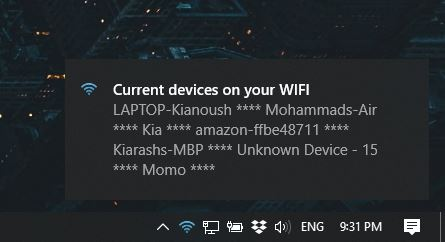
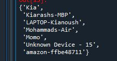

# WiFi Desktop Notification
This project will show you how to list all users connected to your wifi network using Python 3.


If you use wireless internet at home, you probably have several devices connected to your network. It’s so easy to keep piling on additional devices, too: your new laptop, another video game console, a new tablet, or even your friend’s phone.


However, with your WiFi network being so ubiquitous, you may begin to lose track of everything that’s connected, or worse, notice things that don’t belong. There may even be users who have tried to connect to your Wi-Fi network without your permission or knowledge.


 You can use this project to get notified when a specific person (or persons) has arrived home/work.


 
 
 
 
## Install

### Dependencies

You need the following dependencies:

- python3
- pyowm
- win10toast


### Install the repo and the requirements

Clone the repo and install 3rd-party libraries.

```bash
$ git clone https://github.com/Kianoush-h/WIFI-listener-and-Desktop-Notifier.git
$ cd WIFI-listener-and-Desktop-Notifier
$ pip3 install -r requirements.txt
```

 
## Run the code

You can run the the code with this:

```
python3 Weather.py
```
After you run the mentioned code, you will see a desktop notification on your screen which is something like this:




 This notification appears each 15 minutes which you can change it to your preferences.
 
 
 
## CODE

Importing libraries 
 
 ```
from selenium import webdriver 
from selenium.webdriver.firefox.options import Options
from win10toast import ToastNotifier 
import time
 ```
 
 Desktop notification object
 
 ```
toaster = ToastNotifier() 
 ```


Page that you can retrive your wifi info from:

 ```
url = 'http://192.168.2.1/'
driver.get(url) 
print('Modem page is opened')
time.sleep(10)
 ```
 
 
 Before we call the weather function we need to set the delay amount that we want:
 
  ```
delay =  60 * 15  #     60 s * 15 min
now = time.time()
old = now

 ```
 
 After all with this loop the weather notification will apear each 15 min:
 
  ```
while now < old + delay:
    
    if now + 5 >= old + delay:
        old  = time.time()
        weather()
    now  = time.time()
 
 ```
 
 Here the code retrives the list of the devices on your wifi:
 
 ```
  while now < old + delay:
        
        if now + 5 >= old + delay:
            old  = time.time()
            
            a = driver.find_element_by_class_name('dm-list-ul')
            a = a.text.split('\n')
            print('Devices are exported')    
            
            devices = []
            for i in a:
                if 'IP:' in i or 'MAC:' in i:
                    pass
                else:
                    devices = devices + [i]
                    
            devices = set(devices)    
            print(devices)
            
 ```
 After it listed the devices you will see them on your console:
 
 

 
 Meanwhile, the code generates a desktop notification with the list of devices:
 
 ```
  result = ''
            for i in devices:
                result = result + i + ' **** '
            toaster.show_toast("Current devices on your WIFI", result, duration = 5, icon_path="icon.ico", threaded=True) 
        now  = time.time()
```
 


 
 
 # Future 
 You can use this project to get notified when a specifi person (or persons) has arrived home/work.
 For example, when your friend gets to your door you get a notification on your Telegram or on your phone via SMS.


# Contact Me

Email: haratiank2@gmail.com

YouTube channel: https://www.youtube.com/channel/UCvf9_53f6n3YjNEA4NxAkJA?view_as=subscriber

GitHub: https://github.com/Kianoush-h

LinkedIn: https://www.linkedin.com/in/kianoush-haratiannejadi/


